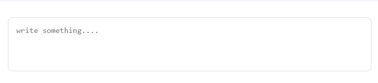
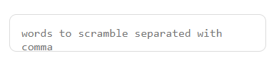
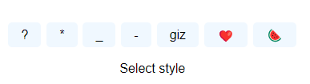
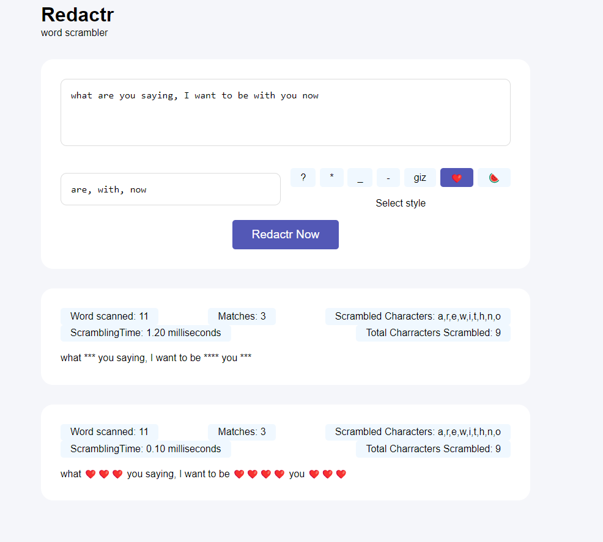

# Redactr

Redactr is a web application built with JavaScript, CSS and HTML

Redactr basically scramble words entered by the user who he /she does not want his readers to see. It allows special characters like
- *
- ?
- _
- -
- giz
- 🍉
- ❤️
to be used as scrambling characters

## usage
1. enter your sentence or post here


2. enter words to be scrambled here


3. select the style you want from here

by default it iuses the "*" astericks

4. finally click on the redactr now button  to see the scrambled word


## Example output


## Set-up Guidline

1. clone the repository to your local machine
````bash
git clone https://github.com/chile4coding/redactr.git

````

2. Navigate to the redactr directory and open the `index.html` file in your web browser to launch the application.

## Appreciation
Thanks to DeveCareer for the oppurtunity  given to me in training me to become a backend engineer

